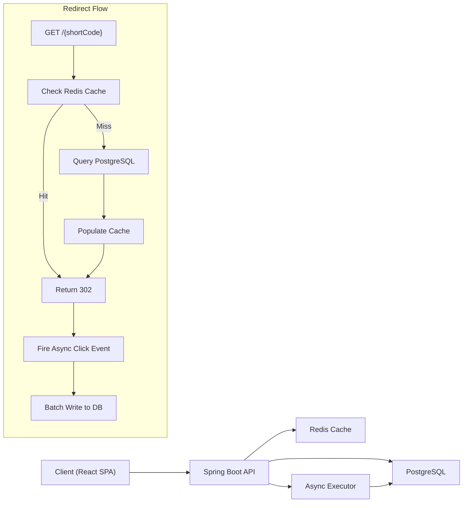
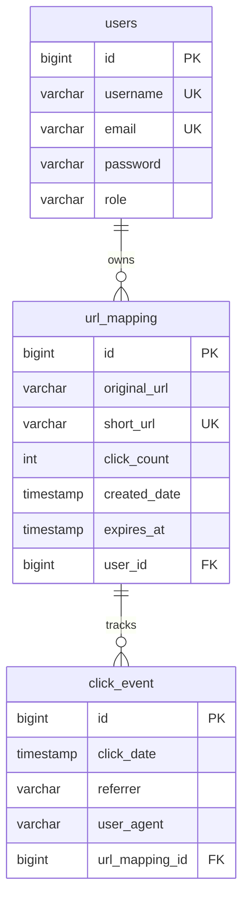

# URL Shortener — Production Backend Project

A production-style URL shortening service built with Spring Boot, React, PostgreSQL, and Redis. Features JWT authentication, async click analytics, Redis caching, rate limiting, and Docker containerization.

## Architecture



**Key design decisions:**
- **Cache-aside pattern** on the redirect hot path — Redis sits in front of PostgreSQL to minimize DB reads on the most latency-sensitive endpoint.
- **Async analytics** — click events are published to an async executor and batch-written to the database, keeping redirect response times under a few milliseconds.
- **Stateless API** — JWT-based authentication with no server-side sessions, enabling horizontal scaling.

## Tech Stack

| Layer | Technology |
|-------|-----------|
| **Backend** | Spring Boot 3.4, Java 23 |
| **Frontend** | React 19, Vite 7 |
| **Database** | PostgreSQL 16 |
| **Cache** | Redis 7 |
| **Auth** | Spring Security + JWT (jjwt 0.12) |
| **ORM** | Spring Data JPA / Hibernate |
| **Build** | Maven, Docker, GitHub Actions |
| **Testing** | JUnit 5, Spring Boot Test, H2 (test) |
| **Observability** | Spring Boot Actuator, Micrometer |

## Project Structure

```
├── src/main/java/com/url/shortener/
│   ├── config/             # Redis, async, logging configuration
│   ├── controller/         # REST controllers (auth, URLs, redirects, analytics)
│   ├── dtos/               # Request/response DTOs
│   ├── exception/          # Custom exceptions and global handler
│   ├── models/             # JPA entities (User, UrlMapping, ClickEvent)
│   ├── repository/         # Spring Data JPA repositories
│   ├── security/           # Spring Security config, JWT filter, rate limiting
│   └── service/            # Business logic (URL mapping, caching, analytics)
├── src/test/               # Unit and integration tests
├── frontend/
│   ├── src/
│   │   ├── components/     # Reusable UI components
│   │   ├── context/        # React auth context
│   │   ├── pages/          # Dashboard, analytics, login, register
│   │   └── services/       # Axios API client
│   └── Dockerfile
├── docker-compose.yml      # Full stack: API + frontend + PostgreSQL + Redis
├── Dockerfile              # Multi-stage Spring Boot build
└── load-test/              # k6 performance benchmarks
```

## Getting Started

### Prerequisites

- Java 23+
- Maven 3.9+
- Node.js 22+
- PostgreSQL 16+
- Redis 7+

### Option 1: Docker Compose (Recommended)

```bash
cp .env.example .env
# Edit .env with your JWT secret and database credentials

docker-compose up -d
```

- **Frontend**: http://localhost:3000
- **API**: http://localhost:8080
- **Health check**: http://localhost:8080/actuator/health

### Option 2: Local Development

1. **Start PostgreSQL and Redis** (locally or via Docker):
   ```bash
   docker run -d --name postgres -p 5432:5432 -e POSTGRES_DB=urlshortener -e POSTGRES_PASSWORD=secret postgres:16
   docker run -d --name redis -p 6379:6379 redis:7
   ```

2. **Run the backend**:
   ```bash
   ./mvnw spring-boot:run -Dspring-boot.run.profiles=local
   ```

3. **Run the frontend**:
   ```bash
   cd frontend
   npm install
   npm run dev
   ```

### Running Tests

```bash
# Unit and integration tests
./mvnw test

# Load tests (requires k6)
cd load-test
k6 run redirect-load-test.js
```

## API Overview

| Method | Endpoint | Auth | Description |
|--------|----------|------|-------------|
| `POST` | `/api/auth/public/register` | No | Register a new user |
| `POST` | `/api/auth/public/login` | No | Login, returns JWT |
| `POST` | `/api/urls/shorten` | JWT | Shorten a URL (supports custom aliases) |
| `GET` | `/api/urls/myurls` | JWT | List user's URLs (paginated) |
| `PUT` | `/api/urls/{id}` | JWT | Update URL metadata |
| `DELETE` | `/api/urls/{id}` | JWT | Delete a shortened URL |
| `GET` | `/{shortCode}` | No | Redirect to original URL (302) |
| `GET` | `/api/analytics/summary` | JWT | Dashboard summary |
| `GET` | `/api/analytics/daily` | JWT | Daily click aggregation |
| `GET` | `/api/analytics/top` | JWT | Most-clicked links |
| `GET` | `/actuator/health` | No | Health check |

## Database Schema



## Feature Roadmap

- [x] URL shortening with random code generation
- [x] JWT authentication and user management
- [x] Basic click counting
- [ ] Database unique constraint on short codes
- [ ] Extracted short-code generation service
- [ ] URL validation and normalization
- [ ] Custom short aliases
- [ ] URL expiration with 410 Gone
- [ ] Delete and update endpoints
- [ ] Paginated and sortable URL listings
- [ ] Redis cache-aside pattern for redirects
- [ ] Cache TTL and invalidation
- [ ] Async click analytics (off critical path)
- [ ] Batch analytics writes
- [ ] Referrer and user-agent tracking
- [ ] Analytics dashboard with charts
- [ ] Rate limiting (per-user and per-IP)
- [ ] Per-user shortening quotas
- [ ] Centralized exception handling
- [ ] Structured API error responses
- [ ] Integration and unit test suite
- [ ] Docker and Docker Compose
- [ ] GitHub Actions CI/CD pipeline
- [ ] Spring Boot Actuator health and metrics
- [ ] Structured request logging
- [ ] Load testing and performance benchmarks

## License

Portfolio project — not intended for production deployment.